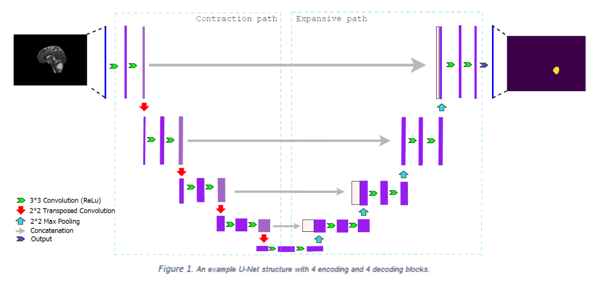

# A quantitative comparison between Focal loss and Binary Cross-Entropy loss in Brain Tumor Auto-segmentation using U-net!

## About the research.
1. Brain tumors are among the fatal cancers and cause the death of many people annually. Early diagnosis of a brain tumor can help save the patient's life.

2. We have collected a dataset consisting of 314 brain MRI images in all planes taken by giving a contrast medium with the dimension of 800*512, which offers the highest resolution. First, skull stripping has been implemented to separate the brain from other parts in the images. Next, we have annotated the tumors in the images under the supervision of experienced radiologists to create ground truth. 

3. Comprehensive literature review on essential loss functions commonly used in image segmentation with U-net has been done, specifically focusing on Tversky Loss, Binary Cross-Entropy loss function Dice Loss, and Focal Loss. To determine the most effective model versions for all three loss functions, hyperparameter tuning was performed. The number of epochs and alpha values associated with the loss functions were optimized during this process. Following the comparison, the study further evaluates the effectiveness of two loss functions, Binary Cross-Entropy (BCE) and Focal loss, specifically in handling tumor regions within the dataset. Subsequently, the U-net convolutional neural network was implemented on the dataset using the two loss functions.

4. The two proposed loss functions were evaluated using 5-fold cross-validation, and the average precision, recall, and f1 were 76.16%, 71.9%, and 74.52 for BCE loss and 82.92%, 79.32%, and 81% for the Focal loss on the test data, respectively. Moreover, the accuracy for BCE loss was 99.03% and 99.44 % for the Focal loss.
5. It is evident that precision, recall, accuracy, and dice coefficient (f1 score) obtained from the U-net model with Focal loss are significantly higher than the U-net model with BCE loss. Based on the results, training U-net on an enriched database containing more than three hundred brain MRI images with high resolution makes it possible to locate and diagnose the tumor in the brain and achieve high Precision in the brain tumor semantic segmentation task.

## Examples of predicted tumor segment by the current U-Net implementation.
meningioma       	  | glioma		| 	pituitary tumor             
:-------------------------:|:-------------------------:|:------------------------:
  |  		| 
  |  		|  
  |  		|  

## Getting Started
Here we will explain how to get the [data](https://drive.google.com/drive/folders/13Odglap6pPoqptcc-JkKrAXRTf1RPdxQ?usp=sharing) and convert it into the usable form. You can run the train and run model using [notebook](https://github.com/mahdishafiei/Brain-Tomur-Semantic-segmentation/blob/main/Unet%20training%20and%20coefficients.ipynb).
* it is better to use the notebook in the Colab environment however you can use it locally but you should make some changes to it about loading the dataset.
### Dataset
you should donwload the provided dataset and put it in the appropriate directories base on what is in the [notebook](https://github.com/mahdishafiei/Brain-Tomur-Semantic-segmentation/blob/main/Unet%20training%20and%20coefficients.ipynb).
### Prerequisites
You will need Python 3.X.X with some packages which you can install direclty using requirements.txt.
> pip install -r requirements.txt
## Model Architecture
Here is the structure of model

## Author:
* Mahdi Shafiei : [Linkedin](https://www.linkedin.com/in/mahdi-shafiei-bb4a531b7/)
* Hamid Jahani: [Linkedin](https://www.linkedin.com/in/hamid-jahani/)